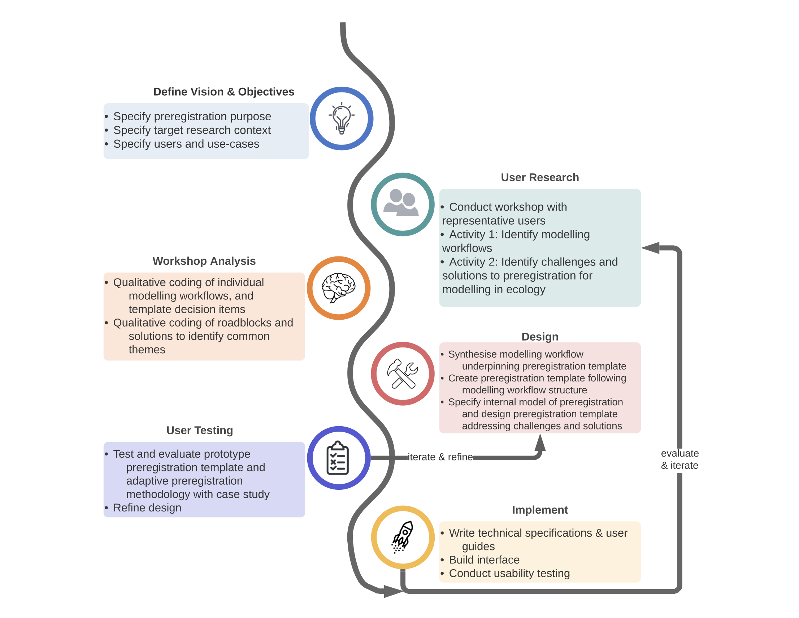

**Intended journal:** Methods in Ecology and Evolution.

**Article Type:** Research Article

*The Abstract must not exceed 350 words and should list the main results and conclusions, using simple, factual, numbered statements:*

*Point 1: set the context for and purpose of the work;*

*Point 2: indicate the approach and methods;*

*Point 3: outline the main results;*

*Point 4: identify the conclusions and the wider implications.*

**Keywords** *(no more than 8 for MEE).***:** *preregistration, preregistration template, modelling, applied ecology, conservation decision-making, metaresearch, reproducibility, non-hypothesis testing(?).*

----

## Introduction ##

### Problem ###

Ecology as a discipline is at risk of a "reproducibility crisis" (Fidler et al. 2017), with rates of Questionable Research Practices (QRPs) in ecology similar to those in other fields (Fraser et al. 2018), such as psychology and medicine, where the crisis has received considerable attention, and provoked heated discussion among researchers within the broader scientific community. In particular, there are serious problems with the way ecological models and the modelling process are reported in the published literature. However, concerns about poor model reporting practices are not new, and have been raised repeatedly --- nearly a decade ago researchers concluded that most model reporting was neither transparent or comprehensive [@Schmolke:2010fd; @deVos:2011], and that a culture of model reporting was yet to be established [@Grimm:2014es]. Moreover, most models were assessed predominantly on the basis of scientific originality during peer-review  [@Schmolke:2010fd] to the effect that the burden of evaluating models for credibility is placed onto the reader or model-user, rather than the peer-review process, especially in the case of extremely complex models [@Alexandrov:2011iv]. 

Despite attempted to promote thorough and transparent model documentation using 'Good Modelling Practice' (e.g. [@Jakeman:2006ii;@Alexandrov:2011iv]), more recent quantitative assessments of transparency and reproducibility demonstrate that the transparent model reporting is still an ongoing problem. Just as Jakeman argued that many models in the published literature lack a clear statement of model objectives and purpose, lack descriptions of model assumptions and implications, and also fail to report model results, including validation and evaluation in 2006, [-@Jakeman:2006ii], [@Feng2019]'s quantitative assessment of Ecological Niche Models found that reporting of model evaluation and model results was less than adequate.

We should be concerned about research transparency because, a lack of complete and transparent reporting practices provide the conditions in which QRPs are likely to arise [@Fidler:2017he]. Moreover, as Morrison [-@Morrison:2016cd] demonstrated, when models are not reported transparently with sufficient detail, they cannot be reproduced. This is particularly problematic because in ecology, models are typically used in decision-support, often directly underpinning policy and management decisions. Incomplete and non-transparent reporting of the model and the modelling process risk the model being used in inappropriate applications or decision contexts [@Grimm:2014es] because the underlying modelling choices and assumptions are not communicated [@deVos:2011]. Alternatively, a lack of transparency may mask poor model design or serious flaws in the model, with the risk that they be used in decision support resulting in wrong, or irreversible decisions [@Grimm:2014es;@Schmolke:2010fd]. A lack of transparency in reporting also risks undermining the credibility of the model, such that the decision-maker rejects the use of the model and instead turns to unstructured and subjective judgments [@Grimm:2014es;@Addison:2013wa], thus contributing further to "decision complacency", or the "knowing-doing" gap [@Gardner:2018dm]. 

Preregistration is a practice that has been adopted in disciplines that have confronted the 'reproducibility crisis' head-on, and can improve the transparency and reproducibility of ecological models. Preregistration requires the methods and analysis plan of a future study are registered in a secure and accessible platform prior to any data collection, and after submission it can no longer be altered. Preregistration distinguishes between what is a genuine a priori planned analysis, and what is not (Parker, Fraser, and Nakagawa 2019), and therefore prevents the opportunistic misuse of researcher degrees of freedom or 'Questionable Research Practices' (QRPs, Wicherts et al., 2016). Researcher degrees of freedom refer to the many analytic decisions a researcher makes during the planning, data collection, data analysis and reporting of results in scientific studies (Wicherts et al. 2016; Simmons, Nelson, and Simonsohn 2011). Examples of these analytic choices include whether to exclude observations, whether more data should be collected, which set of conditions should be combined and compared, which model evaluation metric should be used, etc. Coupled with a lack of transparency -- or "undisclosed flexibility" -- researcher degrees of freedom are vulnerable to being exploited by researchers because of cognitive biases and incentive structures within science. \<lead in sentence to next para??\>

Ecology has seen recent improvements in journal policy concerning reporting guidelines and data/code archiving, but there has been slow uptake of other important tools, like preregistration and registered reports (Parker, Fraser, and Nakagawa 2019). Pu et al. 2019 found that conceptual barriers may prevent users from different disciplines to think that preregistration is "not for them", this was a particularly salient sentiment for researchers engaged in non-experimental studies. We have experienced this sentiment ourselves when looking at preregistration templates to use for model-based research --- nearly all preregistration templates are geared towards experimental hypothesis-testing research. Such templates contain items that are simply irrelevant to model-based and/or applied ecological research. More importantly, they do not reflect the iterative nature of model development [@MacEachern2019] and fail to capture critical analytic decisions in the modelling process. Presently, we are aware of only a single preregistration template for modelling [@Cruwell2019b], however it is steeped heavily in an an academic psychology context, is focussed on the use of models for hypothesis-testing, neglects the entire model development process, and approaches modelling from a very narrow epistemic function, in a way that is not commonly applied in ecology.

Preregistration cannot simply be ported over to other disciplines and adopted as-is. If we wish to adopt preregistration in ecology, specifically within model-based research, both the content required to be preregistered, as well as the procedure for creating a preregistration must be adapted to suit model-based research as it is undertaken in ecology. Different research methodologies, and their specific and nuanced application across different domains and fields of study follow different analytical choices and are therefore susceptible to different QRPs. Consequently, domain-specific templates are necessary for guiding preregistration in such a way that restricts researcher degrees of freedom as they uniquely emerge within a domain or field-specific application of a particular research methodology.

### Research Aims, and Template Objectives ###

The goal of this study is to \<rethink\> preregistration to better suit the domain-specific challenges and methodological particularities of model-based research in ecology. This research builds on recently developed "QRP roadmaps" (Gould et al. 2019) and research by Cruwell et al. (2019) showing that existing templates are too general, and do not account for domain-specific and research category-specific nuances and questionable research practices. We aim to develop a template for preregistering ecological models, and devise a methodology for implementing an expanded view of the preregistration process, 'adaptive preregistration' (*sensu* Srivastava), that better accounts for the inherently iterative nature of model development than static, deterministic document-based preregistration. 

We aim to consider questions such as... (open questions we had about preregistration)...

Finally, we develop and evaluate both the template and proposed adaptive preregistration process with a case-study of environmental-flow modelling in Victoria, Australia.

----

## Methods ##

### User-centred design approach ###

**Designing Preregistration Templates with a User-Centred Design Approach**

   

We took a user-centred design (UCD) approach to the task of translating preregistration into model-based research contexts for ecology and conservation. UCD is a philosophy for designing services or products that accounts for user requirements at all stages of the design process --- the goal of which is to generate both an effective and usable tool for specific people in specific contexts [@Pavelin2012]. As Pavelin et al illustrate,  it is critically important that users be involved in the design process because it is difficult to predict how users will actually use a resource. This mirrors Pu et al's qualitative analysis into preregistration design, that a designer's intention for preregistration and users' purposes for preregistration may be in conflict and undermine the overarching goal of preregistration --- to improve the reliability of scientific findings. Consequently, although user-centered design is typically used within software engineering domains, we heed Pu's advice that "It is crucial to treat preregistration [...] as a user-centered design problem to ensure preregistration achieves its intended goal."

   

We borrow from the UCD methodology proposed by Pavelin et al. [-@Pavelin2012], and follow the core steps : 1. Define the goals of the resource under development and identify audience, 2. Characterise users and their needs, 3. Design mock-ups of your product, 4. Build prototypes of selected mock-ups and test with users, 5. Implement the product, writing technical implementations and building the product. In the case of this project, the 'product' consists of a preregistration template, specification of the internal logic of the template, including an updated domain-specific procedure for using the template, a user-interface for completing the preregistration, and a user-guide to accompany the template and interface.

#### Define Vision & Objectives ####

**Intended Purpose of this Preregistration**

   

Defining the purpose and intended use-cases of a preregistration template has important implications for the design of the template --- from its structure, content, user-interface and use within the broader research workflow. We define the primary purpose of the template as "to delimit researcher degrees of freedom" when conducting model-based research in applied ecology and conservation. Although others have defined the purpose of preregistration to include 'delineating between *exploratory* from *confirmatory* research' \<refs\>, this is not the intended purpose of the template here. Beyond hypothesis-testing contexts, this is a simplifying dichotomy that, in practice, is more blurred and nuanced than the ideal. For instance researchers might move back and forth between different reasoning-modes throughout the modelling cycle. Thinking through how modes of inference might hold within applied ecological modelling contexts requires further, more careful thought, and consideration of research from philosophy of science. Consequently, we wish to deemphasise the purpose of distinguishing between exploratory and confirmatory research, and focus the design of the templates in being able to delimit researcher degrees of freedom, so as to reduce the potential for cognitive biases, such as confirmation bias, and other questionable research practices, like cherry-picking, HARKing etc. \<insert ref to my QRP manuscript\>.

   

See margin notes from Mac eachern... for this section.

Moallemi I described the querying of he model in,y as exploratory.

Brief mention of abduction.

   

   

The secondary purpose of the model is to increase *research transparency* of model-based research in ecology and conservation. *Research transparency* refers to both production transparency --- which includes research artefacts like open-access data and materials, or data collection procedures --- and analytic transparency --- which describes a complete account of how the analytic conclusions are drawn from the data (Lupia and Elman, 2014). \<refs to model reporting literature- it's dire, can't properly be evaluated by a reviewer, moreover can't be reproduced\>

   

**Preregistration template users and research-contexts**

   

Given the stated purposes of the preregistration templates we designed, it implies two types of users: creators of preregistrations using the template, and reviewers of a completed template, including reviewers, journal editors and any readership. The content and structure of the items on the template will be designed with the preregistration-creator and the preregistration readership in mind - it will capture critical decision-points that may influence the overall model and analysis and recommendations or decisions that the model informs, thus delimiting researcher degrees of freedom at these junctures in the modelling decision process. It should also enhance the research transparency of the study, ensuring that these choices are documented with sufficient transparency to let the reader make informed decisions about the credibility and reliability of the model and associated analysis and interventions.

   

More specifically, we intend this template to be suitable not just in 'pure-research'-only contexts, but to be suitable for ecologists and conservation decision-makers who are working in the 'actionable sciences' \<which guy was this again.. Sutherland?? define\>.  The template should be adequate for use by scientists and modellers working in applied ecological contexts, but also for management and conservation decision-making contest where there are real-world decisions hinging on the model-based research.

   

\<Research Types: Modelling - what do we mean by modelling?? I think if we don't specify this then people will just think 'classical linear regression' as modelling, and then will say, well why don't use existing hypothesis testing templates, like AsPredicted. I need to specify some particularities about the type of modelling that occurs in in these research contexts, and why existing templates don't suit, and that we need to design specifically for these research contexts.\>

   

**Use-Cases**

   

Depending on what role is assumed, there are different 'use-cases' for authors, reviewers/editors *Pu et al.* However, these use-cases are not typically explicitly designed for.  For example, reviewers and editors (and sometimes authors) face the problem of 'checking' --- that is, 'the process of comparing a manuscript to its preregistration and verifying that the study and the analyses are conducted as the preregistration has specified.' Existing preregistration formats are designed with the role of the author in mind --- they are text-based documents, that are ill-suited to checking the reported study against the preregistration.

Consequently, we aim not just to simply design a new template, deciding on its structure and content, but we propose a workflow and methodology to be implemented by the author when completing a preregistration of their model-based research \<see section - inner logic of the model - discuss features model-based research, like iterative development?\>

Questions included: should we and how can we change the medium of the template and/or archiving platform to accomodate any roadblocks? How could we change the medium of both the template and the archiving platform to accommodate these issues? What procedural and or technical solutions could we implement to address these roadblocks to preregistration? What decision-tools could be used to aid in completing a preregistration? What sort of parsimony should we aim for in terms of the resolution of the templates and therefore their applicability across different methodologies?

   

**Identifying aspirations and desirable attribute for the template**

   

   

What attributes do we aim for the template

A) an interface that ensures ease of use for the creator of a preregistration

B) structure and content that is necessarily opinionated.. forces user to a particular workflow, so getting that workflow right, that reflects both norms and practice of model-based research is pivotal.

#### User Research ####

On the 4^th^ March 2020, we ran a series of structured activities designed to inform the development of two pre-registration templates, one for field-work and sampling design, the other for modelling and data-analysis. We split the activities into two groups, to better focus discussion for each of these templates. All workshop materials and workshop outputs can be found on the OSF component here \<LINK\>.

   

The collaborative workshop activities aimed to help us:

a) understand how science is done in practice so that we can use this to inform and tailor the preregistration templates to adequately capture key decision-points in the scientific process;

b) understand how science in practice, whether due to logistical, technical feasibility or normative constraints, differs from some idealised practice;

c) identify challenges and roadblocks to the use and uptake of preregistration in among ecologists and conservation scientists, both in academic and applied research contexts; and to

c) Use this knowledge to inform the design of the templates so they meet their intended purpose and are taken up by researchers.

   

**Activity 1 - Capturing Scientific Workflows and Decision Points**

   

The objective of this activity was to capture critical decision-steps in the design of both field sampling efforts and modelling exercises. This activity was intended to identify key decision-steps in the scientific process that should be included in a preregistration template.  The first part of this activity was done as individuals, where we reflected on our scientific process for a recent or memorable research project. We listed the steps in the workflow from beginning to end. We attempted to document  critical decision-steps in this process that should be present on a preregistration template. By "critical" we mean that without these decision-steps the template would not a) adequately constrain researcher degrees of freedom and b) transparently document the analytic decision-process. 

   

In the second part of this exercise, we came together as a group to collate each of the steps in our personal workflows onto a group workflow template This template was prepared earlier (\<specific OSF link to the document\>), and consisted of several key 'phases' of the scientific process, with decision-steps grouped under each phase. The development of the draft modelling workflow was derived from previous work by Gould et al. *in prep.,* whilst the field sampling workflow was created specifically for this exercise. We sorted and categorised each decision-step as belonging to a particular workflow phase. Next we grouped similar decision-steps that could be included as a single item on a preregistration template. At the end of this process we reviewed the suggested phases on the workflow to assess whether phases needed further discretisation, aggregation, removal, or amendment. 

   

## Workshop Activity 2: Understanding ecology- and modelling-specific challenges to adopting preregistration in research practice

   

This second activity aimed to identify critical challenges and roadblocks to the implementation and uptake of preregistration in ecology and conservation, as well as their solutions. We conducted two lots of structured discussions, one for each of the field and modelling template groups. Each discussion was structured using a series of pre-prepared questions and talking points informed by recent debates about preregistration in the literature. These talking points were chosen with the aim of identifying problems in the content and or structuring of the phases and decision steps that were collectively identified in activity 1, as well as any conceptual or philosophical issues with preregistration in ecology, conservation, and in particular modelling, that might impact on the template structure, content and procedural implementation of preregistration.

##### Workshop Analysis #####

#### Design ####

##### Translating Workflows into a Preregistration Template #####

**1\. Synthesise Workshop Outputs: Identify Scientific Workflows for ecological modelling, both real/in-practice and idealised.**

   

The goal of this analysis task was to generate a complete draft workflow for both fieldwork and modelling and data-analysis that will form the basis of the final preregistration templates. We used a combination of inductive and deductive coding \<is this what it is called\> to analyse the workshop outputs and generate a model scientific workflow for model-based research that would constitute the presumed scientific workflow that would be used to guide the structure of the preregistration template. We collated and coded the workshop outputs using \<atlas.TI, insert software citation and version\>, \<a qualitative coding software\>. All workshop outputs can be found here (\<Link to Workshop Outputs OSF repository\>). 

A preliminary idealised scientific workflow for ecological modelling research was synthesised after reviewing the literature on 'good modelling practice' and structured decision-making literature in ecological management. Steps in the workflow were coded and broken down into 'phases' consisting of 'steps' and 'substep' \<insert link to appendices or just present the final?\>. Each decision-point in the personal modelling workflows generated from activity one of the collaborative workshop were coded as belonging to one of these phases, steps and substeps. We revised the coding structure \<inductively (is this the word)\>, according to patterns and themes identified across multiple personal workflows. For example, we added the final phase \<name for last phase\>, which aimed to capture the fact that analysts usually present the results of their modelling to clients, decision-makers or other stakeholders that must interpret the evidence and are responsible for making management decisions. In this way, we identified a common or generalised workflow from different types of applied ecological modelling projects that synthesised both \<idealised norms and norms of practice, Pu et al., see other philosophy of sci refs\>. This workflow is used to provide structure and content to the preregistration template.

   

**2\. Translating Workflows into Preregistration Templates**

   

We translated the model-based workflow identified in part I of workshop analysis into a text-based preregistration template. Reflecting on existing templates \<link to OSF repository of templates \>, we identified common elements / units of preregistration templates that we mapped onto the generalised modelling workflow identified in part I of workshop output analysis. We synthesised the following ontologies:

   

1\. Decision Phase - each has a "title" and "description" or "definition", steps are grouped under phases. \<Note, that these are being scrapped from the template and are turned into tool-tips\>

2\. Decision Step - each has a "title" and "description" or "definition" choices are grouped into 'steps'. Corresponds to an activity or set of activities in a scientific workflow. \<again, these are being scrapped and turned into tool-tips.\>

3\. Choices ---\> each 'choice' corresponds to a uniquely numbered item on the PRT requiring a response from user. The style should be in the form of a directive or a question. E.g. "explain how you will do xyzzy". Or "What performance measure will you use for assessing 'goodness of fit'?"

   

[@Moallemi2019] featuresof a good guideline:

   

a) A standard step-wise structure relevant to a variety of (exploratory modelling) methods in robust decision

support.

(b) The enumeration of (methodological and mixing design) choices available at each step to reflect on alternative

options available to researchers.

(c) Examples/illustrations to clarify the step of the guideline and choices at each step.

(d) An easy to follow checklist to promote wider adoption.

   

   

**3\. Designing a new methodology for implementing preregistration in model-based research**

   

We analysed the outputs of Activity 2 in the collaborative workshop identifying barriers and solutions to undertaking preregistration in model-based research and to broader adoption of preregistration in the applied ecology and modeller communities of practice to design a preregistration procedure appropriate for this research domain. We considered such questions as:

\- What should a research workflow look like for a modeller in an applied ecology setting who wishes to preregister their work?

\- How do we accommodate the iterative cycle of model development into the preregistration process?

\- At what stage in a modelling or structured decision-making process should preregistration begin?

   

We then used 'in situ evaluation' to test and evaluate both the template and procedure design.

##### Redesigning a new methodology for preregistering model-based ecology and conservation research #####

##### 'In-situ' Evaluation and Testing of Templates #####

*Evaluation Criteria and Rationale*

   

\<which other template design papers have included evaluation criteria and rationale, Sophia's?\>

Of primary concern was the structure and content of the preregistration template, however we also aimed to evaluate both the procedure and the interface for completing the preregistration. Much like variable selection during model-building, the template should be 'parsimonious' - without the inclusion of any given item on the template, it would not adequately a) constrain researcher degrees of freedom and b) transparently document the decision-process of the modeller during model development. Yet, with too many items, or with too high a resolution of the template items, the preregistration would be too difficult and time-consuming to complete.  We evaluated the template items based on these two criteria.

Modellers \<here, here, and here\> have expressed concern about preregistration making modelling a more difficult task than it already is, and hampering the ability to meet project deadlines, especially in decision-problems. Many modellers already struggle with sufficiently documenting models during publication and reporting \<ref, model reporting and transparency review\>, and modellers working in government or other agencies have expressed concern that preregistration will simply add to the list of  'red-tape' expected of them. Given these concerns, and considering the concerns of many with regard to the iterative nature of model development precluding making preregistration impossible or inappropriate, we figured it was of utmost importance that the templates be also evaluated on their ease-of-use and feasibility.

   

*Evaluation Method*

   

We tested and evaluated the templates on the ability to meet these criteria by using a model-based research case-study \<see box\>.  Rather than 'digging back' through the version history of a completed preregistration to ask researchers about the process and how it had been developed in detail \<like Pu et al\>, we chose to leverage the version-control and collaborative project management features of Git and GitHub [@BenBondLamberty:2018by; @Blischak:2016kr] as a tool for documenting both the analytic decisions of the researcher, and for using the preregistration process itself to 'live-develop' the template template. For example, if it turned out that we had missed an important item, or perhaps the phrasing of an item or the order and structure of the template needed to change whilst in the process of completing the preregistration, the suggested change, and its justification would be both recorded in GitHub and linked to the actual preregistration. Since *Pu et al* (p16). Found that the process of creating a preregistration is 'difficult to reconstruct with interview questions alone', we we aimed to capture the analysts 'thinking in the moment' by using comments and GitHub issues as to why a particular decision about the template item inclusion and specification should change. \<How we did this using GitHub:How to present this material? Link to the wiki issue and instructions to users?\> 

Finally, we supplemented this 'in situ' testing and evaluation process with a semi-structured interviews in order to capture more detailed reflections of the analysts. This was because analysts were often under strict time-constraints, trying to meet their deliverables for the project. In addition, the process of preregistration was a new and unfamiliar task.

\<TEXT HERE DESCRIBING THE ENVIRONMENTAL FLOWS MANAGEMENT PROBLEM + RESEARCH PROBLEM, to be completed by Chris / Lyndsey\>.

----

## Results: A methodology for Preregistration in Ecology and Conservation ##

----

### Internal Model of Preregistration ###

Failing to make the 'internal model of preregistration' clear to users is a critical source of confusion among preregistration template users that may impede preregistration uptake, and undermine the ability of the template to achieve its objectives (Pu et al. 2020). Consequently, in this section we articulate the inner logic of our preregistration templates that informs the the content, structure of the template, and our proposed procedure and interface for implementing the template.

**Modelling workflows for Ecology and Conservation**

   

Table X, below, describes the 'model scientific workflow' underpinning the template, which was identified through the structured collaborative workshop, literature review and qualitative coding. By articulating this workflow, we explicitly state the workflow and sets of activities that the template presumes. We identified and coded decision-points into 6 'phases' in the process of developing, evaluating and analysing a model or models in ecological application: 'problem formulation', 'define conceptual model', 'formalise and specify model', 'model validation and evaluation', 'model analysis', 'model application'. These phases are comprised of a series of smaller 'steps' and 'substeps', which are defined and described in detail within Table X. The broad phases and steps are used to structure the template by grouping similar modelling activities together, and the descriptions and definitions of the phases and steps are used as 'help-text' in the template interface. 

   

   

We synthesised the literature on many different environmental modelling 

   

We synthesised modelling workflows from various 

   

Although there are many different environmental modelling frameworks 

   

We synthesised the literature on many different environmental modeling frameworks with the outputs of our workshop.

\- 

   

@TODO - anything about *applied contexts??* Aligning with management? (In terms of the structure and steps above).

@TODO insert table from atlas TI.

**Iterative Cycle of Model Development**

   

During our structured discussions, we identified the iterative nature of model development as a key barrier to adopting preregistration. 

   

\<Insert refs to literature describing this\>.  \<Explain what I mean by iterative model development and provide examples\>

   

\<Explain why this is a barrier to preregistration\>

   

   

Typically, the process of preregistration is completely distinct from and precedes the implementation of the analysis plan laid out in the preregistration. In fact, preregistration has been defined as "the action of confirming an unalterable version of one's research plan prior to collecting data" (Nosek et al. 2018) or prior to analysing the data (Ref, or link to secondary data preregistration template). This results in a linear research workflow, whereby a researcher shifts from the process of ideation and design, documentation of that design in a preregistration, to the process of action, where the researcher executes the plan specified in the preregistration \<insert link to this fig..\>

Translating the preregistration process to a modelling research context is thus challenging because the iterative nature of model development conflicts with the inner logic of existing preregistration templates that presume a linear research workflow. For instance, some modelling decisions are inherently dependent on the outcomes and results of previous decisions and analyses, which involves conducting some preliminary or investigatory analyses before being able to specify future decision-steps in an analysis plan, contravening the critical(?adj) feature of preregistration of specifying the analysis plan prior to seeing the data. Moreover, some items in the template, particularly at later stages of modelling, might not be able to be answered by the researcher until the model is fully or close to fully specified on a first-pass (e.g. specifying exactly what sensitivity analyses or uncertainty analyses will be conducted). This might especially hold true for more complex process models. \<Mention that this is not a flaw in preregistration, but rather reflects the inner logic of preregistration for hypothesis-testing contexts\>

__The *checking* problem__

   

Authors, reviewers, editors and readers may all engage in the process of checking a report or manuscript against its preregistration to verify that the study and analyses were conducted as specified in the preregistration. However, existing preregistration formats \<do not encourage/make the process of checking difficult\> --- static text-based documents are designed for authors to quickly input the desired information. In fact, *Pu et al* go so far as to say that this format "verge[s] on being write-only media" and are therefore completely ill-suited to the checking task. 

The task of model checking is further complicated by the non-linear and iterative nature of model development. It is difficult to verify the conducted study and analysis against the preregistered analysis for existing preregistration formats used in hypothetico-deductive research . However, when the modelling and preregistration is iterative, such that there might be interim preregistrations, then this means that there are *multiple* versions of the preregistration to check against the completed analysis.

The question we faced then is, how do we design both the format of the template, and its procedure for completion by the author, so that we facilitate preregistration checking --- especially when this task is complicated by the iterative nature of model development? *Pu et al* put forth two design elements that may facilitate checking. They recommend designs that "make relevant preregistration easier to *query*" and that "encourage wider *coverage* of preregistration content during review".

   

For *Pu et al.* The process of *querying* a preregistration consists of "paper-to-preregistration" and "preregistration-to-paper" lookup whereby the reader searches for relevant information from the paper in the preregistration and *vice-versa*. This requires that the report of paper must be specific in referring to parts of the preregistration, *and*, that the author has tagged the relevant part of the preregistration in their report or manuscript.

   

Consequently we propose a methodology for managing the preregistration process that leverages features of GitHub that implement the task of linking the actual study and analysis that was conducted to the pre-specfied plan in the preregistration \<link to part of GH methodology that explains how checking is accounted for in the procedural design\>. In addition, we designed our shiny interface for completing the preregistration to include a 'checking mode' that easily allows the author to state how and why the the analysis might have diverged from the planned \<link to part of shiny app interface that discusses checking mode\>.

   

---------

*I'm not exactly sure whether this content should go here in a summarised form or whether it should go into its respective places coming up in the manuscript and we just link to it.* 

   

*How does our GH procedure incorporates checking:*

1\. Using issues to track committed work on the same analysis task, and that issue is spawned from a template item so the conducted work is inherently linked to that initial plan.

2\. In the preregistration document 

*How does our shiny-preregistration Interface incorporates checking:*

\- Checking mode - The author can switch to checking mode after having conducted the analysis for a given PRT item. *Or* after the preregistration is complete. 

What do you think about this process? What if we allowed check boxes in our preregistration software design so that the author could switch to 'checking mode' and they can tick some boxes Yes / No / Partial match. For No and Partial, they briefly describe \_how\_ it varies from the preregistration, and why (could link to the GitHub issue thread where conversation and decisions were logged during the process of conducting the analyses).

This is going to take some further thought because there might be \_interim\_ versions of the document. Our process means that the author keeps adapting the preregistration until they actually go ahead and implement it... so doesn't this mean that they will \_always\_ follow their latest version of the preregistration?? I guess then checking entails a comparison of first and interim preregistrations against the actual conducted analysis, not just the final.

AND it is possible that in other cases the author deviated from their plan for some reason, and didn't follow our proposed process using GH. So we want to allow for this to occur, but for the author to be able to state \_that\_ this happened, \_how\_ it differs, and why.

---------

This will be a box or a table with numbered items, with just the preregistration item directives or question. The help-text describing each phase or key steps in the workflow is removed, as this goes in the previous table under 'model scientific workflow'. Could possibly go into the appendix, but I think given that it's the primary research output, it should go into the main-text of the manuscript.

----

### Adaptive Preregistration for model-based research using GitHub ###

The process of preregistration as it is currently implemented is tailored towards the hypothetic-deductive model of the scientific method, and thus follows a linear process, where the process of planning and preregistering is distinct and completely precedes the execution of that plan. The researcher shifts from ideation, to study/analysis design and preregistration, to collecting and analysing the data, writing the report or manuscript, to publishing ([*cos.io/rr*](http://cos.io/rr)) \<See also Figure 1 in Pu et al.\> The iterative nature of model development, however, inherently precludes this model of preregistration from being applied to model-based research in ecology and conservation.

Firstly, as Srivastava notes, there are some decisions that are either difficult to anticipate, or simply cannot be made in advance \<Srivastava\>. This is particularly true for decisions occurring at the later phases of the modelling construction and development process (Fig X), where downstream decisions depend on the outcomes of earlier decisions and outcomes of modelling analyses. For example, in the modelling process we have described (previous section), some decisions cannot be made unless you have a fully specified model, such as \<sensitivity analysis, and other model evaluation tasks and test\>.

Secondly, very often in modelling, preliminary or exploratory analyses must be implemented before decisions can be made about how to proceed. For example, modellers might need to check the distribution of particular variables in order to determine how to specify the model, perform assumption checks, or check for collinearity or spatial autocorrelation. Sometimes the results of these analyses and checks mean that the modeller is forced to return to earlier decision-points and change the analysis. For instance, the model might fail to converge, or perhaps there is insfufficient data to fit the desired model such that the model runs out of variation to apportion to all the different variables \<there's a name for this\>.

   

Consequently, we take an 'expanded view of preregistration', that fits with the concept of 'adaptive preregistration' proposed by \<Srivastava\>. This view of preregistration breaks with the current model of preregistration, wherein the author writes a single deterministic preregistration containing a rule for every decision, and shifts from ideation, preregistration to execution of the plan. Two features define adaptive preregistration. It contains 'plans to deploy flexible strategies' \<Srivastava\> wherein the author can supply a heuristic consisting of multiple different analysis or modelling strategies whose execution depends on the outcome of previous decision-points or analyses. Secondly, the preregistration may be iterative and consist of interim preregistrations that mark phases of modelling and analysis as different parts of the data are observed \<Srivastava\>. Thus, as the modeller proceeds through the model development process, the researcher can shift from ideation, preregistration, execution of the analysis and back to ideation and preregistration again, depending on the observed outcomes as each interim preregistration is executed \<Link to Figure, GitHub as a platform for adaptive preregistration, <x-scrivener-item:///Users/egould/Dropbox/Apps/Scrivener/PhD_thesis.scriv?id=32FCFBDA-7CEE-4FD9-B8DD-F3073309C0D0>\>.

Given the iterative nature of adaptive preregistration then, the current convention of the static text-based document format of preregistration is inadequate. If there are interim versions of a preregistration, each version must be time-stamped and *version-controlled*, such that it is clear not just that two or more versions differ from each other, but it is apparent in exactly *how* they differ. Moreover, the *checking problem*, is exacerbated --- for flexible modelling and analysis strategies, we need to be able to link the results of preliminary analyses back to the specified strategy: the link between a particular triggered decision, and the analysis outcome that triggered it must be explicit. In addition, if the results of some preliminary analyses cause revisions to the model itself or a different modelling procedure or approach to be selected, then the trigger for this decision must be explicitly linked to the new version of the preregistration. 

   

We propose leveraging both the *version-control* and the project management features of *GitHub* \<link to GitHub\> as a tool for implementing adaptive preregistration \<link to box\>. When a document is version-controlled using git and GitHub, each version of a document is time-stamped, and is assigned its own unique document identifier, or *commit-hash.* Because GitHub documents are 'time-stamped' the genesis of the preregistration from one version to the next is apparent. Moreover, using the *diff* view of a document on *GitHub*, exactly *how* a document has changed between versions is clear - additions are coloured green, deletions are coloured red, and changes within a line are highlighted \<insert picture\>. Since the preregistration document would exist within the project *repository* containing the data and modelling and analysis code itself, any results from analyses that cause the analysis plan to change can be linked and referenced in the updated version of the plan --- thus facilitating the process of model checking. By providing a method for contrasting the actual analysis undertaken against the registered analysis, this is a mechanism for allowing reviewers to properly evaluate  the preregistration against the reported analysis. It thus provides a way of marking preregistered parts of a report from non-preregistered parts of the analysis. 

   

   

   

   

**How it works....**

GitHub is used to track amendments to the preregistration --- each time an additional question is answered, or an alteration is made to the preregistration, the change should be *committed* to the *repository*. *Semantic versioning* is used to document each version of the preregistration.  *Semantic versioning* is an open-source software engineering practice used to document and and communicate the development of software, in a way that allows others to depend on it [@Kitzes2018vn;@Raemaekers2017]. We have created our own *semantic versioning* scheme to be used to specifically document the incremental version of the preregistration, in tandem with *GitHub's* tag and release feature, each interim preregistration is tagged and released with its semantic version number. 

   

   

   

All questions that can be answered should be completed before any data analysis or modelling proceeds. The preregistration should be completed until a) no further detail can be supplied or b) no additional template item can be answered until preliminary investigations or analyses are undertaken (Fig X, steps 1 - 3).

   

**Shifting from planning to execution**

Before shifting from planning to the execution of the interim preregistration, each complete response in the interim preregistration should have a corresponding *GitHub issue* created (Figure X, step 3, document). \<define GitHub issue, <https://guides.github.com/features/issues/>\>. Relevant discussion between analysts about how to proceed with the intended analysis or interpreting preliminary results are tracked within an *issue*'s thread. Each issue is assigned a unique number. Any code or analysis outputs, such as figures, tables or other files, should be committed and tagged with the issue number, so that all analysis addressing that task is tracked within the *issue's* thread (Fig X, step 4, Do) \<screen-cap?\>. The URL for the GitHub issue should then be added to the relevant preregistration item, the preregistration document should then be committed with the changes, and the version number of the preregistration updated in a new *release*. 

   

... **And back again.**

As the modelling proceeds, further detail on later phases of the analysis can be iteratively updated and preregistered. Where the results of model evaluation and analysis reveal that there are problems with the model, plans can be changed, and again the next phase can be preregistered. For example, if a researcher finds that assumptions are violated or other unexpected results occur that force a change to the planned analysis, the preregistration can be updated based on the findings of those analyses. When this occurs, the *major* version number of the preregistration document should be incremented (Fig X steps 5 - 6). Since the findings of the analyses are tracked within the relevant issue for that template item, and the issue is recorded in the preregistration itself, the trigger for the change in the plan is made explicitly clear.

For each altered or new preregistration item, a the issue thread should either be updated, or a new issue created respectively (Fig X, step 6). Those analyses are then either reconnected based on the revised plan or the new investigatory analyses are then conducted (Fig X, step 7).

This process continues until the preregistration is complete, and the researcher can continue to execute the plan as it has been fully described in the final version of the preregistration document (Fig X, step 8 - 9).

   

**Flexible Strategies, Preliminary Analyses or Investigations**

When a researcher needs to conduct preliminary analyses or check parts of the data before committing to a particular decision about the model or analysis, they can specify a flexible strategy in their response to that preregistration item by:

\- stating what needs to be known to move forward with the modelling and analysis

\- explaining how the researcher will test this, and what parts of the data will be used in that analysis

\- describing how the results will be interpreted, listing each potential decision and the analysis result that will trigger that decision, where possible.

   

----

### A Shiny Preregistration Interface ###

**Preregistration Interface**

   

We felt that the length and presence of large chunks of help-text within the template we developed would make using the template to create a preregistration for a study cumbersome, and might act as a barrier for model-based researchers to adopt preregistration. We considered removing in-template text describing and defining key concepts, phases and steps, as well as reducing the number of decision-points in a model-based research workflow captured by the template by removing items within the template. \<@TODO - did we end up removing any items by the end of the preregistration and evaluation with Chris' study?\> While we 'tweaked' the template items and descriptive text during the in situ evaluation of the templates for the environmental flows preregistration, we decided not to alter the template structure and content significantly, but to instead implement a new format and interface for working with the template. We outline these reasons below.

   

1\. Opinionated Design - norms around modelling practice.  'Good Modelling Practice' Literature. This also has the benefit of aiding new modellers.

2\. A related point: linguistic ambiguity and other problems with modelling concepts and terms. Contested terms in the ecological modelling literature about what each different step is, their activities, etc.

3\. *research transparency*. We felt that the decision-points captured in the template are critical to increasing reporting transparency sufficiently for others to properly evaluate the modelling and analysis.

   

Consequently, we instead decided to implement a user-friendly interface that makes the completion of a preregistration with our template much more *approachable\<?adj\>*.

   

   

Reflecting on the in situ evaluation - shiny app

   

*And the in situ evaluation is used to inform the design of a new* interface *- the shiny app.*

   

The shiny app is intended as an interface for authors and analysts to respond to template items and input their planned decisions to complete a preregistration for their study. In addition to having directive text and questions for each item, there is also 'help-text' consisting of descriptions of the modelling phases and steps, as well as definitions and references to supporting resources, such as decision-tools for choosing and justifying methodological choices \<reference to image with shiny app\>

Once the preregistration has been completed \<for the time being, it doesn't actually have to be complete, see 'living preregistration' section\>, the author is able to 'generate a report'. The report removes any supporting text in the user interface, and generates a text-based document, containing the preregistration template items and any responses to them by the author or analyst. This feature is targeted towards reviewers and editors, providing a more condensed version of the preregistration for greater ease of reading.

Norms around preregistration are both uncertain and vary among preregistration users (Pu et al.) By norms, we mean \<insert definition from Pu\>. Given that the preregistration template is *opinionated* in that it presumes particular norms around the modelling research workflow and sets of activities, and decision-points to be reported, we have designed both the underlying infrastructure of the shiny app, and chosen to host the template and interface on GitHub to allow users to adapt any aspect of the template itself to be congruent with their personal needs and norms around model-based practice. 

The GitHub repository storing the template and infrastructure implementing the interface is open-source and able to be *forked* --- this means that a user is able to copy the entire contents of the repository to their own user account on GitHub, to be changed in any way they see fit. We have included design features in the infrastructure of the shiny app that allow for people to very easily change the structure and content of the template, that will then be rendered into the user-interface.  \<Probably won't describe here, but could link to a vignette on the app that describes the following: easy modification - set up the infrastructure of the shiny app to take in a CSV file, which is then exported to a JSON file for creating the shiny app (alt, just modify the JSON directly)\>

   

   

@TODO Insert screenshot of app.

@TODO link to shiny app (make a doi for it).

@TODO make an issue in the shiny repository for being able to 'load' a partially completed preregistration... Maybe we need to export in JSON?

----

## Discussion ##

### talking points ###

*Problem*

   

\> *Lack of discipline specific preregistration templates impedes the uptake of open-science tools, such as preregistration within ecology.*

   

\> *Domain specific templates are necessary for guiding preregistration in such a way that restricts researcher degrees of freedom unique to a particular domain-specific methodology.*

   

*Overarching aim*

   

*We assumed a UX or user-centred design approach to develop a preregistration template and methodology that accounts for the domain and methodology specific nuances in ecology.*

   

   

------ *We did this by:*

*1\. Identifying norms and practices to develop 'idealised' / 'generalised' research workflows that describe sets of commonly undertaken tasks (and some sort of order to reflect the workflow), within an ecological modelling research analysis (within applied settings??). (idealised + practical).*

*2\. We then transformed these workflows into a 'preregistration template', by distilling a set of decision-items that, we think, should a) adequately constrain researcher degrees of freedom to mitigate the risk of Questionable Research Practices in an ecological modelling exercise and b) adequately facilitates* research/analytic transparency. We transformed the decision-steps (the highest resolution) into template items posed as directives or questions for preregistration users to complete, as appropriate, for their study's preregistration.

\> we identified a common or generalised workflow from different types of applied ecological modelling projects that synthesised both idealised norms and norms of practice.

3\. Our UX approach revealed critical features of the model development process, namely the inherent iterative nature of model development, and requirements for model checking that forced us to reconsider the procedure for completing a preregistration suitable to ecological modelling. Consequently, we took an 'expanded view of preregistration', "Adaptive Preregistration", as proposed and first described by Srivastava. Adaptive preregistration 

   

Plans to deploy flexible strategies, and iterative interim preregistrations

4\. 

\> We proposed a methodology for managing the preregistration process that leverages features of GitHub that implement ..... This methodology (and interface?) deviates from the current/traditional deterministic, single-use write-once read-only document currently used in preregistration.

5\. Furthermore, we created an interface for completing and amending interim preregistrations using shinyApps to facilitate uptake of preregistration in both pure and applied ecological modelling research.

   

   

   

*consisting of a series of* 

   

   

   

*(What is a workflow)?? I think one of the CI papers defined this.*

   

*research 'workflows'*

   

*scientific norms and practices specific to ecological modelling*

   

   

   

   

   

*---------*

   

   

*We really didn't know what to expect when we began completing these preregistrations...*

   

*Problems and Challenges in designing preregistration templates*

***TIME***

\- "A natural consequence of increased transparency, is that preregistrations become longer as more possible decisions are made transparent: *increased transparency* implies *increased length*. This trade-off was something we considered important during the design phase, and deciding what was in and out of scope for the preregistration was particularly challenging. Some authors agreed that it did add extra time, but that it was worth it.

\- However, as Pu et al. note, some participants who were both authors and reviewers didn't think that the time-costs of preregistration in research were significantly greater than not preregistering research. Instead they thought of the preregistration process invoking a 'time shift', that brought 'decision points' before data collection instead of during analysis." P.19. In addition, "some reviewers thought that preregistration saves them the time they might have spent wondering about undisclosed flexibilities when working on an un-preregistered paper."

**PURPOSE AND DESIGN IMPLEMENTATION**

\- Competing objectives? Although the purposes of preregistration are not mutually exclusive - as we have decided the purpose of preregistration we have defined here is to both delimit/state flexibility, *and* be flexible. However, "the preference of one purpose over another can have tangible effects on the design of preregistration" p15.

\- **Front-heavy research timeline:** As a way of providing better decision-making to authors. By shifting decision-making to the front. Front-heavy research process. Delays the start of analysis, but results in better decision-making, because the decision-making is more carefully reasoned. But not sure want to set this out as a 'purpose' of the template, or just have this as a section in the reflection towards the end of the manuscript (will depend on how I set up the angle, and the structure of the paper). At the moment, this is my hypothesis, is that it can improve the process, but we'd need to reflect on this. And I think we could do that at the end of the manuscript.

This relates to what Pu et al. found where participants 'felt their research workflow improved by having preregistration as a "forcing function" [...] For example, writing down study plans ahead of time might prompt them to think more thoroughly and to anticipate flexibilities / researchers' degree of freedmen advance.' (Page 13). For reviewers 'participant reports that pregistration makes the review process "easier".'

   

**DEALING WITH CONFLICTING NORMS IN CREATING & USING the PREREGISTRATION TEMPLATE**

   

Hosting the preregistration template on GitHub, has the added benefit of providing a mechanism for dealing with *uncertain* *norms* in modelling practice \<Pu et al\>, and for following modelling methods and decision contexts that might not fit the presumed modelling development cycle underpinning the preregistration template we designed. Anyone is free to *fork* our GitHub repository, meaning that the entire contents of the repository can be copied to a users own repository, and the template is free to be altered as the user sees fit. This provides the opportunity for creating domain- and/or modelling-approach-specific templates \<Cruwell\>.

   

In order to address this confusion among norms, I state the expected norms that the template has been designed around here. However, I don't expect users to agree on this process. Because we have kept the template in a GitHub repository that can be *forked*, people are free to adapt the template (the items themselves) to suit whatever norm they see fit about how preregistrations should be created and used.

   

All questions are on the table. We approached this goal with a 'proof is in the pudding' mentality - what are the limits of preregistration? Does it slow down the research process?

   

   

**------**

**Pu et al: found researchers thought preregistration would delimit creativity and flexibility.**

**[@MacEachern2019]:** 

**"**We fear that preregistration will lessen the engagement of analysts with data and that it represents a step back toward the punch card style of analysis." MacEachern, S. N., & Van Zandt, T. (2019). Preregistration of Modeling Exercises May Not Be Useful. Comput Brain Behav, 2(3-4), 179-182. doi:10.1007/s42113-019-00038-x

   

Ask Chris to reflect on the preregistration process and whether this is true or not. I don't think it is true. I think the opposite is true. This "Punchcard" style analysis they describe is probably actually an artefact of the way statistical analyses are done in science these days - science is a sausage factory of p-values.

   

Combining with other open science tools.

I thinkthe preregistration can easily be usd with a reporting check

It's, such as t proposed by Feng et al. The decisions and details are recorded within the preregistration. Along with any deviation from the initial plan.  
--------------------------
# References