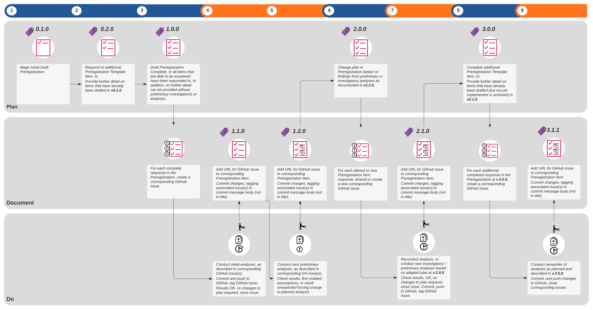

**Intended journal:** Methods in Ecology and Evolution.

*The Abstract must not exceed 350 words and should list the main results and conclusions, using simple, factual, numbered statements:*

*Point 1: set the context for and purpose of the work;*

*Point 2: indicate the approach and methods;*

*Point 3: outline the main results;*

*Point 4: identify the conclusions and the wider implications.*

**Keywords** *(no more than 8 for MEE).***:** *preregistration, preregistration template, modelling, applied ecology, conservation decision-making, metaresearch, reproducibility, non-hypothesis testing(?).*

update for test knit
----

## Introduction ##

### Problem ###

Failure to reproduce a large proportion of published studies in psychology and medicine has received considerable attention and provoked heated discussion among researchers in the broader scientific community. Initial meta-research in ecology has revealed that the conditions found to foster irreproducibility are present (Fidler et al. 2017), evidencing that the discipline is also at risk of a "reproducibility crisis," with rates of Questionable Research Practices in ecology similar to those in other fields (Fraser et al. 2018). Ecology has seen recent improvements in journal policy concerning reporting guidelines and data/code archiving, but there has been slow uptake of other important tools, like preregistration and registered reports (Parker, Fraser, and Nakagawa 2019).

Preregistration is designed to mitigate the opportunistic misuse of researcher degrees of freedom, or "Questionable Research Practices" (QRPs, Wicherts et al. (2016)). Researcher degrees of freedom refer to the many analytic decisions a researcher makes during the planning, data collection, data analysis and reporting of results in scientific studies (Wicherts et al. 2016; Simmons, Nelson, and Simonsohn 2011). Examples of these analytic choices include whether to exclude observations, whether more data should be collected, which set of conditions should be combined and compared, which model evaluation metric should be used, etc. Coupled with a lack of transparency -- or "undisclosed flexibility" -- researcher degrees of freedom are vulnerable to being exploited by researchers because of cognitive biases.

Within basic ecological research employing null hypothesis significance testing, QRPs may increase the probability of false-positive findings (Seaman and Weber 2015; Earp and Trafimow 2015), and may spuriously increase effect size estimates (Wicherts et al. 2016; Parker et al. 2016). QRPs in model-based research may "artificially increase the accuracy or precision of a model, its predictions, and or/evaluation tests to the effect that the model is perceived to be more credible than it would be if the QRP did not occur" (Gould et al. 2019). They are "practices that lead to consumers of the model placing false belief in the reliability, validity and utility of the model than would be warranted without the QRP" (Gould et al. 2019). Some examples of questionable research practices in model-based research include cherry-picking and 'statistic-hacking' model evaluation and test results in order to overemphasise the model's performance and tweaking model priors after fitting the model to data and checking results (Gould, n.d.).

Preregistration requires the methods and analysis plan of a future study are registered in a secure and accessible platform prior to any data collection, and after submission it can no longer be altered. Preregistration guards against questionable research practices, by making clear what is a genuine a priori planned analysis, and what is not (Parker, Fraser, and Nakagawa 2019). Different research methodologies, and their specific and nuanced application across different domains and fields of study follow different analytical choices and are therefore susceptible to different QRPs. Consequently, domain-specific templates are necessary for guiding preregistration in such a way that restricts researcher degrees of freedom unique to a particular domain-specific methodology. Moreover, we believe that a lack of discipline-specific preregistration templates is a key impediment to the uptake of these Open Science tools.

------

   

Problem: "Conceptual barriers to adopting preregistration, including users from different disciplines feeling that preregistration is not for them" Pu et al. (2019).

"Preregistration considered alienating. Researchers who do non-experimental studies expressed a "not for me" sentiment." We have experienced this first-hand by our peers, and even by ourselves, when opening and looking at preregistration templates.

Questions about whether preregistration is useful for exploratory work because it 'limits flexibility' --- and moreover, modelling is, by many, considered exploratory.

### Research Aims, and Template Objectives ###

There are many templates for preregistering experimental research, particularly for studies employing null-hypothesis significance testing. However, to date there is only a single published template for pre-registering model-based studies, and it is for cognitive modelling in psychology (Crüwell and Evans 2019). Consequently, this project aims to develop a template for preregistering ecological modelling research. In this project we aim to develop a template and new methodology for implementing preregistration of ecological models in applied ecology. This research builds on recently developed "QRP roadmaps" (Gould et al. 2019) and research by Cruwell et al. (2019) showing that existing templates are too general, and do not account for domain-specific and research category-specific nuances and questionable research practices. Template development and testing will be driven by a real-world case study of environmental-flow modelling.

### User-centred design approach ###

**Designing Preregistration Templates with a User-Centred Design Approach**

   

As Pu et al. (2019) identify, a designer's intention for preregistration and users' purposes for preregistration may be in conflict and undermine the overarching goal of preregistration --- to improve the reliability of scientific findings. In order to avert this mismatch, we have taken a user-centred design approach to the problem of preregistration. We do this in two ways, firstly, by running a series of structured and collaborative activities in a workshop setting to reflect on our own research experiences in order to capture scientific workflows as they occur practice. And secondly, by using a real-world research problem as a case-study to test and evaluate the templates for utility and feasibility in practice.

   

@TODO what does a UX design approach entail... stating purpose, use-case and contexts a priori? Explain.

   

**Intended Purpose of this Preregistration**

   

Defining the purpose and intended use-cases of a preregistration template has important implications for the design of the template --- from its structure, content, user-interface and use within the broader research workflow. We define the primary purpose of the template as "to delimit researcher degrees of freedom" when conducting model-based research in applied ecology and conservation. Although others have defined the purpose of preregistration to include 'delineating between *exploratory* from *confirmatory* research' \<refs\>, this is not the intended purpose of the template here. Beyond hypothesis-testing contexts, this is a simplifying dichotomy that, in practice, is more blurred and nuanced than the ideal. For instance researchers might move back and forth between different research-modes throughout the modelling cycle. Thinking through how modes of inference might hold within applied ecological modelling contexts requires further, more careful thought, perhaps with the aid of some philosophers of science. Consequently, we wish to deemphasise the purpose of distinguishing between exploratory and confirmatory research, and focus the design of the templates in being able to delimit researcher degrees of freedom, so as to reduce the potential for cognitive biases, such as confirmation bias, and other questionable research practices, like cherry-picking, HARKing etc. \<insert ref to my QRP manuscript\>.

   

The secondary purpose of the model is to increase *research transparency* of model-based research in ecology and conservation. *Research transparency* refers to both production transparency --- which includes research artefacts like open-access data and materials, or data collection procedures --- and analytic transparency --- which describes a complete account of how the analytic conclusions are drawn from the data (Lupia and Elman, 2014). \<refs to model reporting literature- it's dire, can't properly be evaluated by a reviewer, moreover can't be reproduced\>

   

**Preregistration template users and research-contexts**

   

Given the stated purposes of the preregistration templates we designed, it implies two types of users: creators of preregistrations using the template, and reviewers of a completed template, including reviewers, journal editors and any readership. The content and structure of the items on the template will be designed with the preregistration-creator and the preregistration readership in mind - it will capture critical decision-points that may influence the overall model and analysis and recommendations or decisions that the model informs, thus delimiting researcher degrees of freedom at these junctures in the modelling decision process. It should also enhance the research transparency of the study, ensuring that these choices are documented with sufficient transparency to let the reader make informed decisions about the credibility and reliability of the model and associated analysis and interventions.

   

More specifically, we intend this template to be suitable not just in 'pure-research'-only contexts, but to be suitable for ecologists and conservation decision-makers who are working in the 'actionable sciences' \<which guy was this again.. Sutherland?? define\>.  The template should be adequate for use by scientists and modellers working in applied ecological contexts, but also for management and conservation decision-making contest where there are real-world decisions hinging on the model-based research.

   

\<Research Types: Modelling - what do we mean by modelling?? I think if we don't specify this then people will just think 'classical linear regression' as modelling, and then will say, well why don't use existing hypothesis testing templates, like AsPredicted. I need to specify some particularities about the type of modelling that occurs in in these research contexts, and why existing templates don't suit, and that we need to design specifically for these research contexts.\>

   

**Use-Cases**

   

Depending on what role is assumed, there are different 'use-cases' for authors, reviewers/editors *Pu et al.* However, these use-cases are not typically explicitly designed for.  For example, reviewers and editors (and sometimes authors) face the problem of 'checking' --- that is, 'the process of comparing a manuscript to its preregistration and verifying that the study and the analyses are conducted as the preregistration has specified.' Existing preregistration formats are designed with the role of the author in mind --- they are text-based documents, that are ill-suited to checking the reported study against the preregistration.

Consequently, we aim not just to simply design a new template, deciding on its structure and content, but we propose a workflow and methodology to be implemented by the author when completing a preregistration of their model-based research \<see section - inner logic of the model - discuss features model-based research, like iterative development?\>

----

## Methods ##

### Identifying Ecological Modelling Workflows in Practice ###

What attributes do we aim for the template

A) an interface that ensures ease of use for the creator of a preregistration

B) structure and content that is necessarily opinionated.. forces user to a particular workflow, so getting that workflow right, that reflects both norms and practice of model-based research is pivotal.

   

On the 4^th^ March 2020, we ran a series of structured activities designed to inform the development of two pre-registration templates, one for field-work and sampling design, the other for modelling and data-analysis. We split the activities into two groups, to better focus discussion for each of these templates. All workshop materials and workshop outputs can be found on the OSF component here \<LINK\>.

   

The collaborative workshop activities aimed to help us:

a) understand how science is done in practice so that we can use this to inform and tailor the preregistration templates to adequately capture key decision-points in the scientific process;

b) understand how science in practice, whether due to logistical, technical feasibility or normative constraints, differs from some idealised practice;

c) identify challenges and roadblocks to the use and uptake of preregistration in among ecologists and conservation scientists, both in academic and applied research contexts; and to

c) Use this knowledge to inform the design of the templates so they meet their intended purpose and are taken up by researchers.

   

**Activity 1 - Capturing Workflows and Decision Steps**

   

The objective of this activity was to capture critical decision-steps in the design of both field sampling efforts and modelling exercises. This activity was intended to identify key decision-steps in the scientific process that should be included in a preregistration template.  The first part of this activity was done as individuals, where we reflected on our scientific process for a recent or memorable research project. We listed the steps in the workflow from beginning to end. We attempted to document  critical decision-steps in this process that should be present on a preregistration template. By "critical" we mean that without these decision-steps the template would not a) adequately constrain researcher degrees of freedom and b) transparently document the analytic decision-process. 

   

In the second part of this exercise, we came together as a group to collate each of the steps in our personal workflows onto a group workflow template This template was prepared earlier (\<specific OSF link to the document\>), and consisted of several key 'phases' of the scientific process, with decision-steps grouped under each phase. The development of the draft modelling workflow was derived from previous work by Gould et al. *in prep.,* whilst the field sampling workflow was created specifically for this exercise. We sorted and categorised each decision-step as belonging to a particular workflow phase. Next we grouped similar decision-steps that could be included as a single item on a preregistration template. At the end of this process we reviewed the suggested phases on the workflow to assess whether phases needed further discretisation, aggregation, removal, or amendment. 

**Activity 2 - Challenges and Solutions to Preregistration in Ecology**

   

This second activity aimed to identify critical challenges and roadblocks to the implementation and uptake of preregistration in ecology and conservation, as well as their solutions. We conducted two lots of structured discussions, one for each of the field and modelling template groups. Each discussion was structured using a series of pre-prepared questions and talking points informed by recent debates about preregistration in the literature. These talking points were chosen with the aim of identifying problems in the content and or structuring of the phases and decision steps that were collectively identified in activity 1, as well as any conceptual or philosophical issues with preregistration in ecology, conservation, and in particular modelling, that might impact on the template structure, content and procedural implementation of preregistration. 

   

   

Questions included: should we and how can we change the medium of the template and/or archiving platform to accomodate any roadblocks? How could we change the medium of both the template and the archiving platform to accommodate these issues? What procedural and or technical solutions could we implement to address these roadblocks to preregistration? What decision-tools could be used to aid in completing a preregistration? What sort of parsimony should we aim for in terms of the resolution of the templates and therefore their applicability across different methodologies?

### Turning the Workflows into Preregistration Templates ###

All workshop outputs can be found here (\<Link to Workshop Outputs OSF repository\>). 

   

After the workshop, data sheets from activity 1 were collated and coded using atlas.TI. 

   

The point of this activity is to build on the suggested workflows for both fieldwork and modelling to provide structure and content to the preregistration templates.

   

At the end of this exercise we expect to:

   

Have a complete draft workflow for both fieldwork and modelling and data-analysis that will form the basis of the final preregistration templates.

   

Part I: Identify Scientific Workflows for ecological modelling, both real/in-practice and idealised.

   

Objective: Identify common workflow.

   

Step 1: As a group, reflect on personal experience to identify unique decision-steps. Can a generalised / common workflow across individuals be derived? 

   

Step 2: Search literature to to identify an idealised scientific workflow for ecological modelling research. 

   

Step 3: Code workflows identified in step 1 using codes identified in step 3. Revise common workflow.

   

Part II: Translating Workflows into Preregistration Templates

   

We translated the workflows into the preregistration template by using the following ontology:

   

1\. Decision Phase - each has a "title" and "description" or "definition", steps are grouped under phases. 

2\. Decision Step - each has a "title" and "description" or "definition" choices are grouped into 'steps'. Corresponds to an activity or set of activities in a scientific workflow.

3\. Choices ---\> each 'choice' corresponds to a uniquely numbered item on the PRT requiring a response from user. The style should be in the form of a directive or a question. E.g. "explain how you will do xyzzy". Or "What performance measure will you use for assessing 'goodness of fit'?" In addition, we turned to existing preregistration templates to guide the wording  of some items.

### 'In-situ' Evaluation and Testing of Templates ###

Rather than 'digging back' through the version history of a completed preregistration to ask researchers about the process and how it had been developed in detail, we chose to leverage the version-control and collaborative project management features of GitHub \<cite\> as a tool for documenting both the analytic decisions of the researcher, and for using the preregistration process itself to 'live-develop' the template template. For example, if it turned out that we had missed an important item, or perhaps the phrasing of an item or the order and structure of the template needed to change whilst in the process of completing the preregistration, the suggested change, and its justification would be both recorded in GitHub and linked to an actual preregistration.

   

How we did this using GitHub:

   

Instruction to 

   

(As Pu et al did, they used qualitative interviews to 'walk through the version history of the preregistration, and discuss how it had developed in detail' (p.9) --- we can capture some of that thinking in the moment, by using comments and GitHub issues to capture the reasoning in the moment, as to why a particular decision was made or needs to change. However, I do think we should supplement this process with a structured reflection session. 

   

The reason why tried to capture this as we went, is because "the process of creating preregistration  is difficult to reconstruct with interview questions alone" p16.

   

**Case Study: Environmental Flows Management**

   

\<TEXT HERE DESCRIBING THE ENVIRONMENTAL FLOWS MANAGEMENT PROBLEM + RESEARCH PROBLEM\>

----

## A methodology for 'Living Preregistrations' ##

Failing to make the 'internal model of preregistration' clear to users is a critical source of confusion among preregistration template users that may impede preregistration uptake, and undermine the ability of the template to achieve its objectives (Pu et al. 2020). Consequently, in this section we articulate the inner conceptual model of preregistration driving the content, structure and our proposed procedure for implementing the template. 

   

\*\*Modelling workflows for Ecology and Conservation\*\*

   

Table X, below, describes the 'model scientific workflow' underpinning the template, which was identified through the structured collaborative workshop, literature review and qualitative coding. By articulating this workflow, we explicitly state the workflow and sets of activities that the template presumes. We identified and coded decision-points into 6 'phases' in the process of developing, evaluating and analysing a model or models in ecological application: 'problem formulation', 'define conceptual model', 'formalise and specify model', 'Model Validation and Evaluation', 'Model Analysis', 'Model Application'. These phases are comprised of a series of smaller 'steps' and 'substeps'.  These are defined and described in detail within Table X. In terms of how this translates into the format of the preregistration template, these broad phases and steps are used to structure the template, and the descriptions and definitions of the phases and steps are used as 'help-text' in the template interface. 

   

@TODO - anything about *applied contexts??* Aligning with management? (In terms of the structure and steps above).

   

\*\*Iterative Cycle of Model Development\*\*

   

The iterative nature of model development was identified in our structured discussions as a key barrier to adopting preregistration. \<Insert refs to literature describing this\>.  \<Explain what I mean by iterative model development and provide examples\>

   

   

   

   

Typically, the process of preregistration is completely distinct from and precedes the implementation of the analysis plan laid out in the preregistration.	In fact, preregistration has been defined as "the action of confirming an unalterable version of one's research plan prior to collecting data" (Nosek et al. 2018) or prior to analysing the data (Ref, or link to secondary data preregistration template). This results in a linear research workflow, whereby a researcher shifts from the process of ideation and design, documentation of that design in a preregistration, to the process of action, where the researcher executes the plan specified in the preregistration \<insert link to this fig..\>

Translating the preregistration process to a modelling research context is thus challenging because the iterative nature of model development conflicts with the inner logic of existing preregistration templates that presume a linear research workflow. For instance, some modelling decisions are inherently dependent on the outcomes and results of previous decisions and analyses, which involves conducting some preliminary or investigatory analyses before being able to specify future decision-steps in an analysis plan, contravening the critical(?adj) feature of preregistration of specifying the analysis plan prior to seeing the data. Moreover, some items in the template, particularly at later stages of modelling, might not be able to be answered by the researcher until the model is fully or close to fully specified on a first-pass (e.g. specifying exactly what sensitivity analyses or uncertainty analyses will be conducted). This might especially hold true for more complex process models. \<Mention that this is not a flaw in preregistration, but rather reflects the inner logic of preregistration for hypothesis-testing contexts\>

   

\*\*The \*checking\* problem\*\*

   

Model Checking:

"Existing preregistration formats are designed primarily for authors to quickly input the desired information, but may verge on being write-only media: they are ill-suited to the checking task that reviewers, paper readers, and in some cases even authors themselves might perform. Thus, we recommend exploring designs that (1) make relevant preregistration content easier to *query* and (2) encourage wider *coverage* of preregistration content during review." Pu et al. 

   

   

\- how to evaluate studies that have used preregistrations and when they should be compared against their preregistration\> This process of "checking" a preregistered study is provisionally defined by Pu et al. as "comparing a manuscript to its preregistration and verifying that the study and the analyses are conducted as the preregistration has specified." Who engages in 'checking' a preregistration? "Authors, reviewers and editors may all engage in checking." *How do we  facilitate checking? And the "checking problem"* "to what detail should or does an author or reviewer / editor check? Pu et al found that the authors engaged in a linear and thorough checking process, but reviewers on editors were not nearly "as exhaustive with checking". How can we facilitate the process? They found that if the "paper is very specific to referring to parts of the preregistration" then this made it easier for reviewers and editors to check. Maybe we could do something else, rather than get the paper to refer to the parts of the preregistration (but I think we should do this with Chris anyway). If we propose the norm of using GitHub to create and check the preregistration., I think this could be a good way of getting around this checking problem. At the very end we have a 'how to box' targeted at authors. And then maybe we have a box targeted at reviewers? Not sure, maybe just focus this paper on authors and the process of creating and using a preregistration.

   

In order to address this confusion among norms, I state the expected norms that the template has been designed around here. However, I don't expect users to agree on this process. Because we have kept the template in a GitHub repository that can be *forked*, people are free to adapt the template (the items themselves) to suit whatever norm they see fit about how preregistrations should be created and used.

@TODO insert table from atlas TI.

### Iterative Model Development & "Living" Preregistrations ###

Given this defining feature of the modelling process, it is critical that the design of the interface and procedure for implementing the preregistration inherently capture this iterative nature of development. Current formats for preregistration are inappropriate given the iterative nature of the model development cycle, and the need for checking the preregistration against the reported model and analysis. Existing templates are text-based documents wherein authors respond to template items to complete the preregistration. They are standalone documents, with no way of linking the specified decision points to the actual analysis - thereby making model checking extremely tedious. 

   

**Preregistration Interface**

   

We felt that the length and presence of large chunks of help-text within the template we developed would make using the template to create a preregistration for a study cumbersome, and might act as a barrier for model-based researchers to adopt preregistration. We considered removing in-template text describing and defining key concepts, phases and steps, as well as reducing the number of decision-points in a model-based research workflow captured by the template by removing items within the template. \<@TODO - did we end up removing any items by the end of the preregistration and evaluation with Chris' study?\> While we 'tweaked' the template items and descriptive text during the in situ evaluation of the templates for the environmental flows preregistration, we decided not to alter the template structure and content significantly, but to instead implement a new format and interface for working with the template. We outline these reasons below.

   

1\. Opinionated Design - norms around modelling practice.  'Good Modelling Practice' Literature. This also has the benefit of aiding new modellers.

2\. A related point: linguistic ambiguity and other problems with modelling concepts and terms. Contested terms in the ecological modelling literature about what each different step is, their activities, etc.

3\. *research transparency*. We felt that the decision-points captured in the template are critical to increasing reporting transparency sufficiently for others to properly evaluate the modelling and analysis.

   

Consequently, we instead decided to implement a user-friendly interface that makes the completion of a preregistration with our template much more *approachable\<?adj\>*.

   

   

   

**Living Preregistration Workflow** 

   

2\. Workflow - allows for iterative model development AND 

   

Why, what is the current form? Existing templates are read-only documents. 

Capturing this inner logic has repercussions for 

Thus deciding on the inner logic of the template, and what is in and out of scope has been particularly difficult.

One method around this is to accept that the current model of preregistration is not going to work for iterative model development. Again, the more complex the model, the more likely this is to be the case. Consequently I propose a different model of preregistration that I think will work for modeling research contexts. At the moment I'm calling it 'living preregistration' but please suggest another name. Others have termed this 'adaptive preregistration', and this is maybe a better name.

In this model of preregistration, all questions that can be answered, should be answered before any data analysis or modelling proceeds. For some items, particularly during model evaluation and analysis, perhaps only responses of a general nature can be provided. That is OK. As the modelling proceeds. Further detail can be provided and the next phase of analysis can be preregistered. Where the results of model evaluation and analysis reveal that there are problems with the model, or perhaps assumption violations, plans can be changed, and again the next phase of analysis can be preregistered.

A static document for this type of process doesn't really make sense. I propose leveraging the code and project management tools within the GitHub platform as a way of hosting a 'living' or 'adaptive' preregistration. Because GitHub documents are 'time-stamped', the genesis of the preregistration from one version to the next can be traced and tagged with versions. Since the document would exist in the repository with the code itself, any results from analyses that cause the analysis plan to change can be linked and referenced in the updated plan.

   

*How do we accommodate this structurally and procedurally into the PRT?*

   

*1\. Instruction to PRT users:*

   

"If you find yourself needing to check something with the data before committing to a particular decision about the model or analysis (And you hadn't anticipated needing to perform this check), record:

A) the relevant decision in the template.

B) What do you need to know to move forward?

C) How you will test this? What test or analysis will you perform?

D) What values or outputs of the test or analysis map onto particular decisions (they can be qualitative as well)."

   

I will create a template on GitHub based on the above to be used by Chris + Lyndsey for when this occurs, to be stored on the repository wiki. They can insert this template into the relevant decision step / PRT item and fill out.

   

*2\. "Living" or "Timestamped" or "Adaptive" Preregistrations ---Preregistration in the research process:*

   

See Figure 1 in Pu et al. And [*cos.io/rr*](http://cos.io/rr) - Traditionally the process of preregistration and the 'doing' or execution of the plan is a distinct and sequential process. However, this isn't going to work for modelling (What are the *norms* about the process of modelling - stated that it's iterative. And how does this look in practice --- use our in situ evaluation and testing to capture this.

   

This obviously breaks with the convention of preregistrations as 'static' one-off documents... does it break with this convention so far as to no longer be a 'preregistration'?

   

Pu et al: tendency for preregistrations to go from vague / general to specific over time.

   

Importantly, Pu et al show that "not all preregistered studies confirm to their preregistrations, or are inconsistent in reporting deviations", thus by making the preregistration available to reviewers, and by providing a platform and method for linking the actual analysis under-taken, we can allow reviewers to properly evaluate the preregistration against the final paper. (AND, must talk back to original aim of bad reporting practices in modelling). Moreover, if you combine formatting changes with our proposed method with GitHub, we hope to tailor the presentation of the completed preregistration + analysis, such that actual analyses and decisions can be linked directly to both files and outcomes.

   

Using:

\- How to mark the preregistered from the non-preregistered parts of the paper?

\- how to evaluate studies that have used preregistrations and when they should be compared against their preregistration\> This process of "checking" a preregistered study is provisionally defined by Pu et al. as "comparing a manuscript to its preregistration and verifying that the study and the analyses are conducted as the preregistration has specified." Who engages in 'checking' a preregistration? "Authors, reviewers and editors may all engage in checking." *How do we  facilitate checking? And the "checking problem"* "to what detail should or does an author or reviewer / editor check? Pu et al found that the authors engaged in a linear and thorough checking process, but reviewers on editors were not nearly "as exhaustive with checking". How can we facilitate the process? They found that if the "paper is very specific to referring to parts of the preregistration" then this made it easier for reviewers and editors to check. Maybe we could do something else, rather than get the paper to refer to the parts of the preregistration (but I think we should do this with Chris anyway). If we propose the norm of using GitHub to create and check the preregistration., I think this could be a good way of getting around this checking problem. At the very end we have a 'how to box' targeted at authors. And then maybe we have a box targeted at reviewers? Not sure, maybe just focus this paper on authors and the process of creating and using a preregistration.

   

In order to address this confusion among norms, I state the expected norms that the template has been designed around here. However, I don't expect users to agree on this process. Because we have kept the template in a GitHub repository that can be *forked*, people are free to adapt the template (the items themselves) to suit whatever norm they see fit about how preregistrations should be created and used.

This will be a box or a table with numbered items, with just the preregistration item directives or question. The help-text describing each phase or key steps in the workflow is removed, as this goes in the previous table under 'model scientific workflow'.

### Shiny Preregistration ###

The shiny app is intended as an interface for authors and analysts to respond to template items and input their planned decisions to complete a preregistration for their study. In addition to having directive text and questions for each item, there is also 'help-text' consisting of descriptions of the modelling phases and steps, as well as definitions and references to supporting resources, such as decision-tools for choosing and justifying methodological choices \<reference to image with shiny app\>

Once the preregistration has been completed \<for the time being, it doesn't actually have to be complete, see 'living preregistration' section\>, the author is able to 'generate a report'. The report removes any supporting text in the user interface, and generates a text-based document, containing the preregistration template items and any responses to them by the author or analyst. This feature is targeted towards reviewers and editors, providing a more condensed version of the preregistration for greater ease of reading.

Norms around preregistration are both uncertain and vary among preregistration users (Pu et al.) By norms, we mean \<insert definition from Pu\>. Given that the preregistration template is *opinionated* in that it presumes particular norms around the modelling research workflow and sets of activities, and decision-points to be reported, we have designed both the underlying infrastructure of the shiny app, and chosen to host the template and interface on GitHub to allow users to adapt any aspect of the template itself to be congruent with their personal needs and norms around model-based practice. 

The GitHub repository storing the template and infrastructure implementing the interface is open-source and able to be *forked* --- this means that a user is able to copy the entire contents of the repository to their own user account on GitHub, to be changed in any way they see fit. We have included design features in the infrastructure of the shiny app that allow for people to very easily change the structure and content of the template, that will then be rendered into the user-interface.  \<Probably won't describe here, but could link to a vignette on the app that describes the following: easy modification - set up the infrastructure of the shiny app to take in a CSV file, which is then exported to a JSON file for creating the shiny app (alt, just modify the JSON directly)\>

   

   

@TODO Insert screenshot of app.

@TODO link to shiny app (make a doi for it).

@TODO make an issue in the shiny repository for being able to 'load' a partially completed preregistration... Maybe we need to export in JSON?

   

----

## Discussion ##

### talking points ###

*We really didn't know what to expect when we began completing these preregistrations...*

   

*Problems and Challenges in designing preregistration templates*

***TIME***

- "A natural consequence of increased transparency, is that preregistrations become longer as more possible decisions are made transparent: *increased transparency* implies *increased length*. This trade-off was something we considered important during the design phase, and deciding what was in and out of scope for the preregistration was particularly challenging. Some authors agreed that it did add extra time, but that it was worth it.

- However, as Pu et al. note, some participants who were both authors and reviewers didn't think that the time-costs of preregistration in research were significantly greater than not preregistering research. Instead they thought of the preregistration process invoking a 'time shift', that brought 'decision points' before data collection instead of during analysis." P.19. In addition, "some reviewers thought that preregistration saves them the time they might have spent wondering about undisclosed flexibilities when working on an un-preregistered paper."

**PURPOSE AND DESIGN IMPLEMENTATION**

- Competing objectives? Although the purposes of preregistration are not mutually exclusive - as we have decided the purpose of preregistration we have defined here is to both delimit/state flexibility, *and* be flexible. However, "the preference of one purpose over another can have tangible effects on the design of preregistration" p15.

- **Front-heavy research timeline:** As a way of providing better decision-making to authors. By shifting decision-making to the front. Front-heavy research process. Delays the start of analysis, but results in better decision-making, because the decision-making is more carefully reasoned. But not sure want to set this out as a 'purpose' of the template, or just have this as a section in the reflection towards the end of the manuscript (will depend on how I set up the angle, and the structure of the paper). At the moment, this is my hypothesis, is that it can improve the process, but we'd need to reflect on this. And I think we could do that at the end of the manuscript.

This relates to what Pu et al. found where participants 'felt their research workflow improved by having preregistration as a "forcing function" \[...\] For example, writing down study plans ahead of time might prompt them to think more thoroughly and to anticipate flexibilities / researchers' degree of freedmen advance.' (Page 13). For reviewers 'participant reports that pregistration makes the review process "easier".'

   

**DEALING WITH CONFLICTING NORMS IN CREATING & USING the PREREGISTRATION TEMPLATE** 

--------------------------
# References
